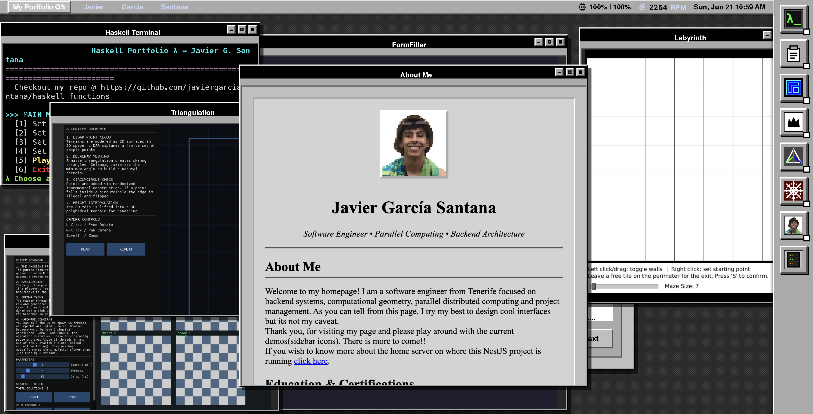

Here is the complete, combined README.md formatted inside a single Markdown code block so you can copy and paste it effortlessly.This includes all your original documentation alongside the newly added architecture diagram and the WebSocket proxy explanation.Markdown# Portfolio OS



A macOS-style web desktop that runs my programming projects as live, interactive windows in the browser — no installation required for visitors. Each project launches in its own floating window with native controls (PTY terminal, VNC stream, or static card).

Deployed on a MacBook 2010 (Core 2 Duo 2.4 GHz, 10 GB RAM, Debian 12 headless).

---

## Projects

| App | Language | Type | How it runs |
|---|---|---|---|
| Haskell Functions | Haskell | Terminal | node-pty → xterm.js |
| FormFiller | Java / JavaFX | VNC | Xvfb + x11vnc + noVNC |
| Labyrinth Madness | Java / Processing | VNC | Xvfb + x11vnc + noVNC |
| N-Queens Parallel | C++ / OpenMP | Terminal | node-pty → xterm.js |
| Polygon Triangulation | C++ / GLFW / OpenGL | VNC | Xvfb + Mesa SW GL + noVNC |
| WP Web Snatcher | Chrome Extension (MV3) | Info card | Static — no server process |

---

## Architecture

```text
Browser
  └── Socket.IO ──────────────────► NestJS (port 3000)
  └── noVNC WebSocket ─────────────► websockify (port 609x)
                                          └── x11vnc (port 591x)
                                                └── Xvfb (:1x)
                                                      └── App process
Session poolGUI apps (VNC type) use a pool of 4 slots. Each slot owns:A dedicated Xvfb virtual display (:10 – :13)A VNC server (ports 5910 – 5913)A websockify WS proxy (ports 6090 – 6093)The app process itselfOn connect → claim free slot → spawn all 4 processes → emit port to browser.On disconnect → SIGTERM chain (ws → vnc → app → Xvfb) → slot freed.Pool full → app-error emitted, visitor shown "try again" message.Terminal apps (PTY type) bypass the pool — they spawn a node-pty process directly per client, unlimited concurrency.DiagramFragmento de códigograph TD
    subgraph ClientLayer [Browser / Frontend]
        UI[Web UI / WinBox]
        Term[xterm.js Terminal]
        NoVNC[noVNC Canvas]
    end

    subgraph BackendLayer [NestJS Backend]
        GW[NativeAppGateway]
        Pool[SessionPoolService]
        PTY[node-pty wrapper]
    end

    subgraph HostLayer [Debian Host OS]
        subgraph PoolSlot [GUI Session Slot n]
            Xvfb[Xvfb virtual monitor]
            App[GUI App: Java/C++]
            VNC[x11vnc Server]
            WS[websockify Proxy]
        end
        
        TUI_App[TUI App: Haskell / C++]
    end

    %% --- Control Flow ---
    UI -- "1. Socket.io (start-app)" --> GW

    %% --- TUI Flow (Terminal Apps) ---
    GW -- "2a. spawn(binary)" --> PTY
    PTY -- "3a. executes" --> TUI_App
    TUI_App -- "stdout" --> PTY
    PTY -- "socket.emit('terminal-output')" --> Term
    Term -- "socket.emit('terminal-input')" --> PTY

    %% --- GUI Flow (Graphical Apps) ---
    GW -- "2b. acquireSlot(appId)" --> Pool
    Pool -- "3b. spawns processes\n(if slot free)" --> PoolSlot
    
    %% --- Inside the GUI Slot ---
    App -. "renders to" .-> Xvfb
    VNC -. "captures" .-> Xvfb
    WS -. "tcp translation" .-> VNC

    %% --- GUI Connection Flow ---
    Pool -. "4b. returns dynamic wsPort" .-> GW
    GW -. "5b. emits ready payload" .-> UI
    NoVNC == "6b. Raw WebSocket Connection\n(Video & Controls)" === WS

    classDef frontend fill:#2b5876,stroke:#fff,stroke-width:2px,color:#fff;
    classDef backend fill:#e0234e,stroke:#fff,stroke-width:2px,color:#fff;
    classDef os fill:#333,stroke:#fff,stroke-width:2px,color:#fff;
    
    class UI,Term,NoVNC frontend;
    class GW,Pool,PTY backend;
    class Xvfb,App,VNC,WS,TUI_App os;
WebSocket Proxy (Mixed Content & Cloudflare)Because the application is served securely over HTTPS via Cloudflare Tunnels, modern browsers enforce strict "Mixed Content" security rules that block insecure WebSocket (ws://) connections. Additionally, Cloudflare Tunnels only expose the primary web port (3000), leaving the internal websockify ports (6090-6093) completely inaccessible from the outside.To seamlessly bridge this gap, the NestJS main.ts implements an internal proxy using http-proxy-middleware.The frontend requests a secure video stream connection to wss://<domain>/vnc/<port>.NestJS intercepts any URL starting with /vnc/ and proxies the WebSocket upgrade natively to the internal process at http://127.0.0.1:<port>.The raw VNC stream safely piggybacks over the primary encrypted HTTPS tunnel, keeping the server firewall completely closed while satisfying the browser's security requirements.Why not Docker?Docker adds ~3–5 s cold-start overhead per container plus significant RAM per instance. Native processes on Xvfb start in ~1.5 s and share the host OS libraries. On a 2010 MacBook this is the difference between usable and unusable.StackRuntime: Node.js + NestJS (TypeScript)Transport: Socket.IO WebSocketsGUI streaming: Xvfb → x11vnc → websockify → noVNC (browser-side RFB)Terminal: node-pty → xterm.jsFrontend: Vanilla JS + WinBox.js (floating windows) + xterm.jsServer: Debian 12, headlessDebuggingPool status (HTTP)Bashcurl http://localhost:3000/debug/pool
Returns JSON:JSON{
  "cap": 4,
  "free": 3,
  "slots": [
    { "n": 0, "status": "running", "appId": "form-filler", "clientId": "abc123",
      "display": 10, "wsPort": 6090,
      "pids": { "xvfb": 1234, "app": 1235, "vnc": 1236, "ws": 1237 } },
    { "n": 1, "status": "free", ... },
    ...
  ]
}
Server logsBash# Follow API logs
journalctl -u portfolio-api -f

# x11vnc logs per slot
tail -f /tmp/x11vnc-slot0.log
tail -f /tmp/x11vnc-slot1.log

# Check VNC ports are listening
ss -tlnp | grep -E '591[0-3]'

# Check websockify ports
ss -tlnp | grep -E '609[0-3]'
Browser consoleThe frontend has a colour-coded debug logger. Open DevTools → Console. Each event is tagged:TagColourCovers[ws]blueSocket.IO connect/disconnect[app]greenWindow open/close events[vnc]orangenoVNC RFB connection lifecycle[err]redErrors from backend or RFBDeploy1. Install dependencies (run once on server)Bashcd deploy
bash install.sh
Installs: xvfb x11vnc novnc websockify openjdk-17 maven cmake libglfw3-dev libgl1-mesa-dev g++ libomp-devBuilds: PolygonTriangulation, n_queens_omp2. Deploy app binaries manuallyAppPath on serverFormFiller (Maven project)/opt/portfolio/form-filler/ (pom.xml + src/)Labyrinth Madness (jars)/opt/portfolio/labyrinth/LabyrinthApp.jar + core.jarHaskell binary/opt/portfolio/haskell-tuiN-Queens binarybuilt by install.sh → /opt/portfolio/n_queens_omp/n_queens_ompPolygon binarybuilt by install.sh → /opt/portfolio/polygon_triangulation/build/PolygonTriangulation3. Start the APIBashcd /opt/portfolio/api
npm ci --omit=dev
npm run build
npm run start:prod
Local developmentGUI apps (VNC) won't work on macOS — no Xvfb/x11vnc. Terminal apps (Haskell, N-Queens) work if binaries are present.To fake a VNC port for frontend testing:Bash# Terminal 1 — dummy TCP listener on slot 0 ws port
nc -l 6090

# Terminal 2 — start API
cd api && npm run start:dev
The frontend will connect and attempt RFB negotiation (which will fail gracefully — enough to test the pool/WS flow).Repo layoutPlaintextportfolio-proj/
├── api/
│   ├── src/
│   │   ├── gateways/
│   │   │   └── native-app.gateway.ts   # WS events for all 6 apps
│   │   ├── sessions/
│   │   │   ├── session-pool.service.ts # 4-slot process pool
│   │   │   ├── session-pool.controller.ts # GET /debug/pool
│   │   │   └── session.module.ts
│   │   └── app.module.ts
│   └── public/
│       └── index.html                  # Frontend — macOS-style desktop
├── deploy/
│   ├── install.sh                      # One-time server setup
│   ├── polygon-triangulation.sh        # cmake build
│   └── n-queens-omp.sh                 # g++ -fopenmp build
└── docs/