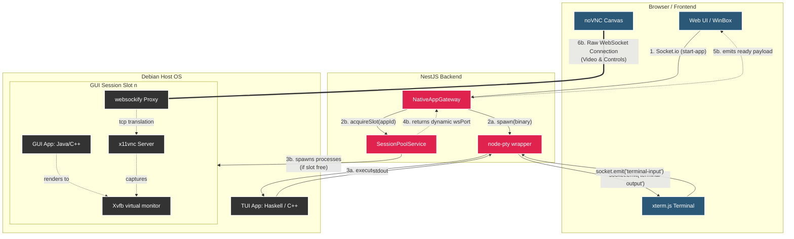

# Portfolio OS


A macOS-style web desktop that runs my programming projects as live, interactive windows in the browser — no installation required for visitors. Each project launches in its own floating window with native controls (PTY terminal, VNC stream, or static card).

Deployed on a MacBook 2010 (Core 2 Duo 2.4 GHz, 10 GB RAM, Debian 12 headless).

---

## Table of Contents

* [Host machine used to run this project](./docs/host.md)
* [My Showcased Projects](#my-showcased-projects)
* [Inner workings](#inner-workings)
* [Managing Docker images](./docs/docker.md)

---

## Projects

| App | Language | Type | How it runs |
|---|---|---|---|
| Haskell Functions | Haskell | Terminal | node-pty → xterm.js |
| FormFiller | Java / JavaFX | VNC | Xvfb + x11vnc + noVNC |
| Labyrinth Madness | Java / Processing | VNC | Xvfb + x11vnc + noVNC |
| N-Queens Parallel | C++ / OpenMP | Terminal | node-pty → xterm.js |
| Polygon Triangulation | C++ / GLFW / OpenGL | VNC | Xvfb + Mesa SW GL + noVNC |
| WP Web Snatcher | Chrome Extension (MV3) | Info card | Static — no server process |

---

## My Showcased Projects

### Labyrinth Madness
**Language:** Java + Processing

A procedurally generated maze visualizer and solver. The maze is built at runtime and rendered via the Processing graphics library. Multiple pathfinding algorithms (BFS, DFS) navigate it in real time. Runs as a GUI application inside a virtual display, streamed to the browser over VNC.

### Haskell Functions
**Language:** Haskell

An interactive terminal showcasing a collection of functional programming algorithms and exercises — list manipulation, recursion, higher-order functions, and type-class-driven polymorphism. Runs as a TUI piped through a PTY directly into an `xterm.js` session in the browser.

### FormFiller
**Language:** Java / JavaFX

A desktop GUI application that automates filling in web forms. The JavaFX interface is rendered on a headless virtual display (`Xvfb`) and streamed live to the browser via `x11vnc` + `noVNC`, giving visitors a fully interactive window into the running app.

### Polygon Triangulation
**Language:** C++ / GLFW / OpenGL

A computational geometry visualizer that triangulates arbitrary polygons in real time using the ear-clipping algorithm. Rendered via Mesa software OpenGL on `Xvfb` (no physical GPU required), then streamed via VNC — making hardware-accelerated-style graphics run on a headless 2010 MacBook.

### Product-E-Match
**Language:** JavaScript / Chrome Extension (MV3)

A browser extension that scrapes and cross-matches product listings across e-commerce platforms to surface pricing and availability at a glance. Requires no server process — presented as a static info card directly in the portfolio UI.

---

## Architecture

```text
Browser
  └── Socket.IO ──────────────────► NestJS (port 3000)
  └── noVNC WebSocket ─────────────► websockify (port 609x)
                                          └── x11vnc (port 591x)
                                                └── Xvfb (:1x)
                                                      └── App process
```

### Session Pool

GUI apps (VNC type) use a pool of 4 slots. Each slot owns:

- A dedicated Xvfb virtual display (`:10` – `:13`)
- A VNC server (ports `5910` – `5913`)
- A websockify WS proxy (ports `6090` – `6093`)
- The app process itself

**On connect** → claim free slot → spawn all 4 processes → emit port to browser.  
**On disconnect** → SIGTERM chain (ws → vnc → app → Xvfb) → slot freed.  
**Pool full** → `app-error` emitted, visitor shown "try again" message.

Terminal apps (PTY type) bypass the pool — they spawn a `node-pty` process directly per client, unlimited concurrency.

### Diagram



### WebSocket Proxy (Mixed Content & Cloudflare)

Because the application is served securely over HTTPS via Cloudflare Tunnels, modern browsers enforce strict "Mixed Content" rules that block insecure `ws://` connections. Additionally, Cloudflare Tunnels only expose the primary web port (`3000`), leaving the internal websockify ports (`6090`–`6093`) inaccessible from the outside.

To bridge this gap, `main.ts` implements an internal proxy using `http-proxy-middleware`:

1. Frontend requests a secure video stream to `wss://<domain>/vnc/<port>`
2. NestJS intercepts any URL starting with `/vnc/` and proxies the WebSocket upgrade to `http://127.0.0.1:<port>`
3. The raw VNC stream piggybacks over the primary encrypted HTTPS tunnel — firewall stays closed, browser security satisfied

### Why Not Docker?

Docker adds ~3–5 s cold-start overhead per container plus significant RAM per instance. Native processes on Xvfb start in ~1.5 s and share host OS libraries. On a 2010 MacBook this is the difference between usable and unusable.

The Docker-based approach — where `dockerode` lets the NestJS backend programmatically spin up isolated containers on the fly — is documented in full at [docs/docker.md](./docs/docker.md). It's a sound architecture for machines with headroom; this server just doesn't have it.

---

## Inner workings

### Used technologies
- [Debian 12](https://www.debian.org/)
- [Node.js](https://nodejs.org/)
- [NestJS](https://nestjs.com/)
- [TypeScript](https://www.typescriptlang.org/)
- [Docker](https://www.docker.com/) + [dockerode](https://github.com/apocas/dockerode)
- [Socket.io](https://socket.io/)
- [WebSockets](https://developer.mozilla.org/en-US/docs/Web/API/WebSockets_API)
- [VNC](https://en.wikipedia.org/wiki/Virtual_Network_Computing) / [x11vnc](https://github.com/LibVNC/x11vnc)
- [noVNC](https://novnc.com/)
- [Xvfb](https://www.x.org/releases/X11R7.6/doc/man/man1/Xvfb.1.xhtml)

### The `Xvfb` virtual monitor

`Xvfb` (X Virtual Framebuffer) is an X11 display server that performs all graphical operations entirely in memory rather than outputting to a physical screen. When a GUI application — JavaFX, Processing, GLFW/OpenGL — starts, it targets a virtual display (e.g. `DISPLAY=:10`). The application thinks it has a real monitor; in reality it is drawing into a region of RAM.

From there the chain is:

1. **`x11vnc`** reads directly from that framebuffer and broadcasts the screen contents over the VNC protocol.
2. **`websockify`** bridges VNC's raw TCP stream to WebSockets.
3. **`noVNC`** in the browser receives the WebSocket stream and renders it onto a `<canvas>`, giving the visitor a live, interactive desktop window — with full mouse and keyboard passthrough — despite the server having no physical monitor at all.

Each GUI session slot (`:10` – `:13`) owns its own independent `Xvfb` instance, so four visitors can each run a different graphical app simultaneously without displays ever interfering.

---

## Stack

| Layer | Tech |
|---|---|
| Runtime | Node.js + NestJS (TypeScript) |
| Transport | Socket.IO WebSockets |
| GUI streaming | Xvfb → x11vnc → websockify → noVNC (browser-side RFB) |
| Terminal | node-pty → xterm.js |
| Frontend | Vanilla JS + WinBox.js (floating windows) + xterm.js |
| Server | Debian 12, headless |

---

## Debugging

### Pool status (HTTP)

```bash
curl http://localhost:3000/debug/pool
```

```json
{
  "cap": 4,
  "free": 3,
  "slots": [
    { "n": 0, "status": "running", "appId": "form-filler", "clientId": "abc123",
      "display": 10, "wsPort": 6090,
      "pids": { "xvfb": 1234, "app": 1235, "vnc": 1236, "ws": 1237 } },
    { "n": 1, "status": "free" },
    ...
  ]
}
```

### Server logs

```bash
# Follow API logs
journalctl -u portfolio-api -f

# x11vnc logs per slot
tail -f /tmp/x11vnc-slot0.log
tail -f /tmp/x11vnc-slot1.log

# Check VNC ports are listening
ss -tlnp | grep -E '591[0-3]'

# Check websockify ports
ss -tlnp | grep -E '609[0-3]'
```

### Browser console

The frontend has a colour-coded debug logger. Open DevTools → Console. Each event is tagged:

| Tag | Colour | Covers |
|---|---|---|
| `[ws]` | blue | Socket.IO connect/disconnect |
| `[app]` | green | Window open/close events |
| `[vnc]` | orange | noVNC RFB connection lifecycle |
| `[err]` | red | Errors from backend or RFB |

---

## Deploy

### 1. Install dependencies (run once on server)

```bash
cd deploy
bash install.sh
```

Installs: `xvfb x11vnc novnc websockify openjdk-17 maven cmake libglfw3-dev libgl1-mesa-dev g++ libomp-dev`  
Builds: `PolygonTriangulation`, `n_queens_omp`

### 2. Deploy app binaries manually

| App | Path on server |
|---|---|
| FormFiller (Maven project) | `/opt/portfolio/form-filler/` (pom.xml + src/) |
| Labyrinth Madness (jars) | `/opt/portfolio/labyrinth/LabyrinthApp.jar` + `core.jar` |
| Haskell binary | `/opt/portfolio/haskell-tui` |
| N-Queens binary | built by install.sh → `/opt/portfolio/n_queens_omp/n_queens_omp` |
| Polygon binary | built by install.sh → `/opt/portfolio/polygon_triangulation/build/PolygonTriangulation` |

### 3. Start the API

```bash
cd /opt/portfolio/api
npm ci --omit=dev
npm run build
npm run start:prod
```

---

## Local Development

GUI apps (VNC) won't work on macOS — no Xvfb/x11vnc. Terminal apps (Haskell, N-Queens) work if binaries are present.

To fake a VNC port for frontend testing:

```bash
# Terminal 1 — dummy TCP listener on slot 0 ws port
nc -l 6090

# Terminal 2 — start API
cd api && npm run start:dev
```

The frontend will connect and attempt RFB negotiation (which fails gracefully — enough to test the pool/WS flow).

---

## Repo Layout

```
portfolio-proj/
├── api/
│   ├── src/
│   │   ├── gateways/
│   │   │   └── native-app.gateway.ts   # WS events for all 6 apps
│   │   ├── sessions/
│   │   │   ├── session-pool.service.ts # 4-slot process pool
│   │   │   ├── session-pool.controller.ts # GET /debug/pool
│   │   │   └── session.module.ts
│   │   └── app.module.ts
│   └── public/
│       └── index.html                  # Frontend — macOS-style desktop
├── deploy/
│   ├── install.sh                      # One-time server setup
│   ├── polygon-triangulation.sh        # cmake build
│   └── n-queens-omp.sh                 # g++ -fopenmp build
└── docs/
```
